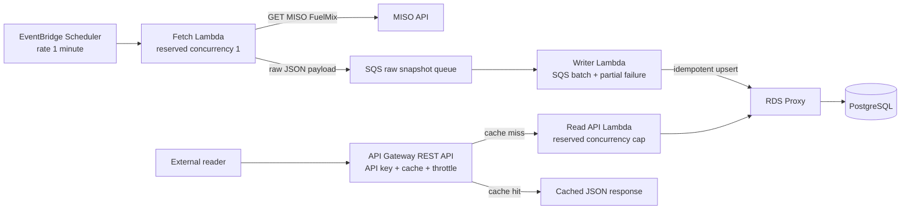

# TEC Fuel Mix Serverless ELT

C#/.NET implementation of a serverless ELT flow for MISO real-time fuel mix data.

## Planning Inputs

This README and `docs/evidence/` are the canonical evaluator-facing implementation and verification surfaces. The planning files below are non-canonical context: they explain earlier design reasoning and task sequencing, but they may include superseded plan steps or evidence targets.

- [planning/tec-fuelmix-plan.md](planning/tec-fuelmix-plan.md): architecture reasoning, scale decisions, data model, and interview talking points.
- [planning/2026-06-22-tec-fuelmix-serverless-elt-implementation-plan.md](planning/2026-06-22-tec-fuelmix-serverless-elt-implementation-plan.md): implementation task plan used for agent-assisted code generation.

Use these only as planning context for why the system uses isolated ingestion, SQS buffering, API Gateway caching, RDS Proxy, PostgreSQL constraints, Terraform, and raw Npgsql instead of EF Core.

## Architecture



The fetch path and write path are intentionally separate:

- `TecFuelMix.FetchLambda` is scheduled once per minute. It only calls MISO and publishes the raw payload to SQS through `RAW_SNAPSHOT_QUEUE_URL`.
- `TecFuelMix.WriterLambda` consumes SQS messages and idempotently writes PostgreSQL through `POSTGRES_CONNECTION_STRING`.
- `TecFuelMix.ReadApiLambda` reads PostgreSQL through `POSTGRES_CONNECTION_STRING` and returns the latest ingested snapshot at `/fuel-mix/latest`. That endpoint is latest-only and rejects query parameters; historical filtering is not implemented in this slice.

SQS protects ingestion durability. If PostgreSQL or RDS Proxy is unavailable after MISO returns a snapshot, the raw payload remains queued for retry and eventual DLQ handling. PostgreSQL unique keys keep duplicate SQS deliveries from creating duplicate snapshots or readings.

API Gateway cache, API Gateway usage-plan throttles, Lambda reserved concurrency, and RDS Proxy protect PostgreSQL from external read traffic. Cache hits do not invoke Lambda or touch the database; cache misses still pass through throttles, a Lambda concurrency cap, pooled proxy connections, and bounded SQL.

## Decision Record

| Decision | Choice | Current status | Why |
| --- | --- | --- | --- |
| Ingestion compute | Scheduled Lambda | Implemented in Terraform as EventBridge Scheduler -> fetch Lambda. | Short scheduled job, explicit one-minute cadence, no idle service. |
| Write buffering | SQS + DLQ | Implemented in Terraform and Lambda wiring. | Preserves fetched payloads when PostgreSQL is unavailable. |
| Read compute | API Gateway + Lambda | Implemented for `GET /fuel-mix/latest`. | Small operational surface; cache/throttle/concurrency controls protect the database. |
| Database protection | API cache + reserved concurrency + RDS Proxy | Implemented in Terraform; live AWS behavior not exercised locally. | Stops repeated reads early and caps connection pressure on PostgreSQL. |
| Data access | Npgsql/raw SQL | Implemented in `TecFuelMix.Core`. | Upsert/idempotency is PostgreSQL-specific and small; EF Core would add ceremony here. |
| Migrations | DbUp console migrator | Implemented for schema, role bootstrap, grants, and optional app-role password rotation. | SQL-first migrations fit the existing schema and make bootstrap rerunnable. |
| Auth | Lambda authorizer + API key usage plan | Lambda authorizer is a planned hardening target; current Terraform uses API key usage plan throttling. | Bearer token should be auth; API key should be throttle/quota only. |
| Infrastructure as code | Terraform only | Implemented; no CDK stack is published. | Avoids duplicate Terraform/CDK stacks while still publishing infrastructure as code. |

## Local Verification

Prerequisites:

- .NET SDK matching `global.json`
- Docker Desktop
- Terraform `>= 1.7.0`

Start local PostgreSQL when running from a clean machine:

```powershell
docker compose up -d db
```

Run the local proof commands:

```powershell
dotnet test .\TecFuelMix.sln
docker compose ps
terraform -chdir=infra/terraform validate
```

Build the Lambda container images:

```powershell
docker build -f .\src\TecFuelMix.FetchLambda\Dockerfile -t tec-fuelmix-fetch .
docker build -f .\src\TecFuelMix.WriterLambda\Dockerfile -t tec-fuelmix-writer .
docker build -f .\src\TecFuelMix.ReadApiLambda\Dockerfile -t tec-fuelmix-read-api .
```

## Deployment Bootstrap

Terraform creates the RDS instance, RDS Proxy secrets, and Lambda environment wiring, but it does not connect to PostgreSQL to apply schema migrations or bootstrap application roles. For an AWS deployment, run the DbUp migrator from an operator host that can reach the private RDS endpoint, using the admin credentials created for RDS. This has not been applied to AWS in this local technical challenge.

Replace the password placeholders with the same values supplied to Terraform for `writer_db_password` and `read_db_password`.

```powershell
$env:POSTGRES_ADMIN_CONNECTION_STRING='Host=<rds-endpoint>;Port=5432;Database=fuelmix;Username=fuelmix_admin;Password=<admin-password>;SSL Mode=Require'
$env:WRITER_DB_PASSWORD='<writer-db-password>'
$env:READ_DB_PASSWORD='<read-db-password>'
dotnet run --project .\src\TecFuelMix.DbMigrator\TecFuelMix.DbMigrator.csproj
```

If `WRITER_DB_PASSWORD` and `READ_DB_PASSWORD` are omitted, the migrator still applies schema and grant migrations but leaves existing role passwords unchanged. Provide both password variables together when creating or rotating the runtime database users.

Captured evidence from this workspace is stored in `docs/evidence`:

| File | Command | Result |
| --- | --- | --- |
| `01-dotnet-test.txt` | `dotnet test .\TecFuelMix.sln` | Passed: 13 tests, 0 failed |
| `02-local-postgres-status.txt` | `docker compose ps` | `db` container running and healthy on host port `55432` |
| `03-terraform-validate.txt` | `terraform -chdir=infra/terraform validate` | Terraform configuration valid |
| `04-docker-fetch-build.txt` | Fetch Lambda Docker build | Image `tec-fuelmix-fetch:latest` built |
| `05-docker-writer-build.txt` | Writer Lambda Docker build | Image `tec-fuelmix-writer:latest` built |
| `06-docker-read-api-build.txt` | Read API Lambda Docker build | Image `tec-fuelmix-read-api:latest` built |

## Scale And Safety Controls

| Control | Where | Why it exists |
| --- | --- | --- |
| One-minute schedule with zero Scheduler retries | `aws_scheduler_schedule.fetch` | Keeps EventBridge Scheduler from re-submitting a failed scheduled invocation. |
| Fetch async retries disabled with 60-second event age | `aws_lambda_function_event_invoke_config.fetch` | Meets the source polling limit by preventing Lambda async retries from re-running the MISO fetch after a post-GET failure. |
| Fetch reserved concurrency `1` | `aws_lambda_function.fetch` | Prevents overlapping MISO fetches from the scheduled path. |
| Fetch async failure DLQ + alarms | `aws_sqs_queue.fetch_async_failure_dlq` and fetch alarms | Preserves terminal async invoke failure details and surfaces fetch failures without re-polling MISO. |
| SQS raw snapshot queue + DLQ | `aws_sqs_queue.raw_snapshot` | Decouples MISO fetch success from database availability and preserves failed writes for retry/redrive. |
| Writer reserved concurrency `1` | `aws_lambda_function.writer` | Keeps database write pressure predictable. |
| Partial batch failure | SQS event source mapping and writer response | Retries only failed SQS records instead of replaying a whole successful batch. |
| PostgreSQL unique keys | `src/TecFuelMix.Core/Schema.sql` | Makes duplicate delivery safe by enforcing one snapshot per `source_ref_id` and one reading per snapshot/category. |
| API Gateway REST cache | `aws_api_gateway_stage` and method settings | Absorbs repeated reads before Lambda or PostgreSQL are involved. |
| API key + usage plan throttle | `aws_api_gateway_usage_plan` | Caps external client request rate and burst size. |
| Read Lambda reserved concurrency | `read_api_reserved_concurrency` | Backstops cache misses so user traffic cannot fan out into unbounded database connections. |
| RDS Proxy pool limits | `aws_db_proxy_default_target_group.postgres` | Pools Lambda database connections and caps pressure on PostgreSQL. |
| Private RDS security groups | `infra/terraform/rds.tf` | Allows PostgreSQL traffic only through RDS Proxy from Lambda clients. |

## Known Boundaries

- Terraform was validated locally only. No `terraform plan` or `terraform apply` was run against AWS.
- RDS role grants and schema/bootstrap execution are documented above but were not applied to AWS. Terraform declares database users/secrets for RDS Proxy auth; PostgreSQL still needs the operational bootstrap step during deployment.
- Lambda runtime secret retrieval is a follow-up. The current app reads full PostgreSQL connection strings from environment variables.
- Live MISO, live SQS delivery, API Gateway cache hit/miss behavior, and RDS Proxy behavior are not exercised by the local evidence.
- Local tests use Docker Compose PostgreSQL on port `55432`; they do not prove AWS networking, IAM, or managed-service behavior.
