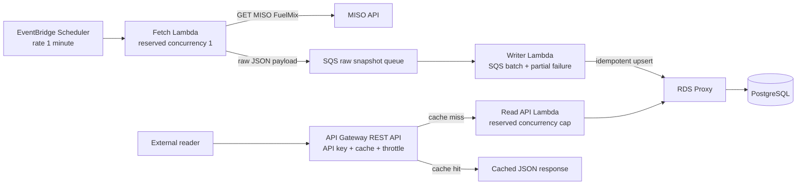

# TEC Fuel Mix Serverless ELT

C#/.NET implementation of a serverless ELT flow for MISO real-time fuel mix data.

## Architecture



The fetch path and write path are intentionally separate:

- `TecFuelMix.FetchLambda` is scheduled once per minute. It only calls MISO and publishes the raw payload to SQS through `RAW_SNAPSHOT_QUEUE_URL`.
- `TecFuelMix.WriterLambda` consumes SQS messages and idempotently writes PostgreSQL through `POSTGRES_CONNECTION_STRING`.
- `TecFuelMix.ReadApiLambda` reads PostgreSQL through `POSTGRES_CONNECTION_STRING` and returns bounded JSON responses for API Gateway.

SQS protects ingestion durability. If PostgreSQL or RDS Proxy is unavailable after MISO returns a snapshot, the raw payload remains queued for retry and eventual DLQ handling. PostgreSQL unique keys keep duplicate SQS deliveries from creating duplicate snapshots or readings.

API Gateway cache, API Gateway usage-plan throttles, Lambda reserved concurrency, and RDS Proxy protect PostgreSQL from external read traffic. Cache hits do not invoke Lambda or touch the database; cache misses still pass through throttles, a Lambda concurrency cap, pooled proxy connections, and bounded SQL.

## Local Verification

Prerequisites:

- .NET SDK matching `global.json`
- Docker Desktop
- Terraform `>= 1.7.0`

Start local PostgreSQL when running from a clean machine:

```powershell
docker compose up -d db
```

Run the local proof commands:

```powershell
dotnet test .\TecFuelMix.sln
docker compose ps
terraform -chdir=infra/terraform validate
```

Build the Lambda container images:

```powershell
docker build -f .\src\TecFuelMix.FetchLambda\Dockerfile -t tec-fuelmix-fetch .
docker build -f .\src\TecFuelMix.WriterLambda\Dockerfile -t tec-fuelmix-writer .
docker build -f .\src\TecFuelMix.ReadApiLambda\Dockerfile -t tec-fuelmix-read-api .
```

Captured evidence from this workspace is stored in `docs/evidence`:

| File | Command | Result |
| --- | --- | --- |
| `01-dotnet-test.txt` | `dotnet test .\TecFuelMix.sln` | Passed: 14 tests, 0 failed |
| `02-local-postgres-status.txt` | `docker compose ps` | `db` container running and healthy on host port `55432` |
| `03-terraform-validate.txt` | `terraform -chdir=infra/terraform validate` | Terraform configuration valid |
| `04-docker-fetch-build.txt` | Fetch Lambda Docker build | Image `tec-fuelmix-fetch:latest` built |
| `05-docker-writer-build.txt` | Writer Lambda Docker build | Image `tec-fuelmix-writer:latest` built |
| `06-docker-read-api-build.txt` | Read API Lambda Docker build | Image `tec-fuelmix-read-api:latest` built |

## Scale And Safety Controls

| Control | Where | Why it exists |
| --- | --- | --- |
| One-minute schedule | `aws_scheduler_schedule.fetch` | Meets the source polling limit and keeps ingestion cadence explicit. |
| Fetch reserved concurrency `1` | `aws_lambda_function.fetch` | Prevents overlapping MISO fetches from the scheduled path. |
| SQS raw snapshot queue + DLQ | `aws_sqs_queue.raw_snapshot` | Decouples MISO fetch success from database availability and preserves failed writes for retry/redrive. |
| Writer reserved concurrency `1` | `aws_lambda_function.writer` | Keeps database write pressure predictable. |
| Partial batch failure | SQS event source mapping and writer response | Retries only failed SQS records instead of replaying a whole successful batch. |
| PostgreSQL unique keys | `src/TecFuelMix.Core/Schema.sql` | Makes duplicate delivery safe by enforcing one snapshot per `source_ref_id` and one reading per snapshot/category. |
| API Gateway REST cache | `aws_api_gateway_stage` and method settings | Absorbs repeated reads before Lambda or PostgreSQL are involved. |
| API key + usage plan throttle | `aws_api_gateway_usage_plan` | Caps external client request rate and burst size. |
| Read Lambda reserved concurrency | `read_api_reserved_concurrency` | Backstops cache misses so user traffic cannot fan out into unbounded database connections. |
| RDS Proxy pool limits | `aws_db_proxy_default_target_group.postgres` | Pools Lambda database connections and caps pressure on PostgreSQL. |
| Private RDS security groups | `infra/terraform/rds.tf` | Allows PostgreSQL traffic only through RDS Proxy from Lambda clients. |

## Known Boundaries

- Terraform was validated locally only. No `terraform plan` or `terraform apply` was run against AWS.
- RDS role grants and schema/bootstrap execution are follow-ups. Terraform declares database users/secrets for RDS Proxy auth, but PostgreSQL role grants still need an operational bootstrap step.
- Lambda runtime secret retrieval is a follow-up. The current app reads full PostgreSQL connection strings from environment variables.
- Live MISO, live SQS delivery, API Gateway cache hit/miss behavior, and RDS Proxy behavior are not exercised by the local evidence.
- Local tests use Docker Compose PostgreSQL on port `55432`; they do not prove AWS networking, IAM, or managed-service behavior.
