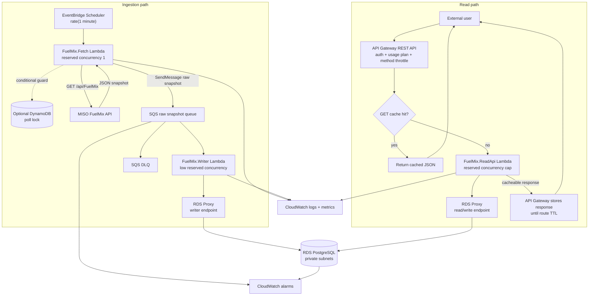

# Plan: TEC Fuel Mix Serverless ELT Service

> Planning input: this was the human architecture and decision plan used to steer agent-assisted implementation. The README is the current evaluator-facing truth for what is implemented and verified.

**Target**: C# / AWS Lambda / SQS / API Gateway cache / PostgreSQL / local-first proof  
**Complexity**: Medium.

## 1. What The Challenge Is Really Testing

The brief is testing whether I can build a production-shaped data ingestion and reporting system:

- Pull real-time public data without violating the source API's polling limit.
- Persist it idempotently into PostgreSQL.
- Expose a safe external read surface without exposing a privileged database user or public database.
- Keep ingestion independent from reads so a user traffic spike cannot interfere with scheduled ingestion.
- Control database load under bursty serverless traffic.
- Prove repeatable deployment with IaC.
- Provide evidence that the system works.

## 2. Evidence From The Brief And Live API

I made one live request to the MISO endpoint. The response shape was:

```json
{
  "RefId": "22-Jun-2026 - Interval 11:05 EST",
  "TotalMW": "82968",
  "Fuel": {
    "Type": [
      {
        "INTERVALEST": "2026-06-22 11:05:00 AM",
        "CATEGORY": "Coal",
        "ACT": "26869",
        "FUEL_CATEGORY": "Coal  (26,869 MW)"
      }
    ]
  }
}
```

Consequences:

- `TotalMW` and `ACT` arrive as strings.
- One response is a snapshot containing multiple fuel rows.
- Battery storage can be negative.
- `INTERVALEST` is source-local. Store it as source-local and preserve the raw payload; do not invent timezone certainty.

## 3. Architecture Blueprint



Read the arrows literally:

- MISO does not push into SQS. The fetch Lambda calls MISO, receives JSON, then publishes to SQS.
- API Gateway cache does not always call Lambda. Cache hits return immediately; only cache misses invoke the read Lambda and reach RDS Proxy/PostgreSQL.
- The writer Lambda is the only ingestion component that writes to PostgreSQL.

Default compute choice:

- Use **Lambda for MISO fetch** because it is scheduled, short-lived, isolated, and explicitly required.
- Use **SQS between fetch and DB write** so a temporary PostgreSQL/RDS Proxy outage does not throw away an already-fetched MISO snapshot.
- Use **Lambda for DB write** because SQS event source mappings, partial batch failure, DLQ redrive, and low reserved concurrency fit this job.
- Use **Lambda for read API** by default because API Gateway + cache + Lambda + RDS Proxy is a scalable read surface with little operational burden.
- Use **ECS for read API** only if traffic is steady enough that warm persistent pools and lower cold-start variance matter more than serverless simplicity.

## 4. Load Protection Model

Reads:

```text
public traffic
  -> API Gateway auth / usage plan / method throttle / cache
  -> read Lambda reserved concurrency
  -> RDS Proxy connection pool
  -> PostgreSQL max connections
```

Writes:

```text
EventBridge
  -> fetch Lambda reserved concurrency 1
  -> SQS queue + DLQ
  -> writer Lambda low reserved concurrency
  -> RDS Proxy connection pool
  -> PostgreSQL transaction/upsert
```

Why this holds under scale:

- Cache hits stop at API Gateway and do not invoke Lambda or touch the database.
- Cache misses still face API Gateway throttling and Lambda reserved concurrency.
- RDS Proxy pools and reuses database connections.
- Writer concurrency is deliberately low because the feed is one snapshot per minute.
- PostgreSQL owns idempotency with unique constraints.

Cache TTLs:

- `/fuel-mix/latest`: 15-30 seconds. Data refreshes at most once per minute.
- `/fuel-mix/categories`: 5-15 minutes. Categories change rarely.
- `/ingestion-runs/latest`: 5-10 seconds, or uncached if live ops status matters.
- `/fuel-mix?from=...&to=...&category=...&limit=...`: 30-60 seconds keyed by normalized query parameters.

Do not cache user-specific responses unless the cache key includes the user-specific dimension. For this challenge the fuel data is the same for every authorized external user, so short shared caching is acceptable.

## 5. Stack Decisions

Use:

- C# / .NET Lambda functions.
- Lambda container images so the compute is containerized.
- SQS standard queue with DLQ between fetch and writer Lambdas.
- Shared .NET class library for parser, DTOs, SQL, and database access.
- PostgreSQL on RDS.
- RDS Proxy for writer and read Lambdas.
- API Gateway REST API for reads because REST APIs support managed stage/method caching.
- API Gateway authorizer plus API key usage plan for external access and throttling.
- EventBridge Scheduler for the one-minute fetch cadence.
- Optional DynamoDB single-item poll lock if manual/retry invocations are allowed.
- Terraform for IaC.
- Docker Compose for local PostgreSQL.
- xUnit for parser/idempotency tests.

Do not add:

- Kinesis, Glue, Redshift, lake storage, or warehouse tooling. The challenge asks for PostgreSQL reporting, not a data platform.
- A browser dashboard before the API proof works.
- A custom auth system.
- Read replicas until cache miss traffic proves the primary needs help.

## 6. Data Model

Use a normalized snapshot/readings design:

```sql
create table fuel_mix_snapshots (
    id bigserial primary key,
    source_ref_id text not null unique,
    interval_est timestamp without time zone not null,
    total_mw numeric(12,3) not null,
    raw_payload jsonb not null,
    imported_at timestamptz not null default now()
);

create table fuel_mix_readings (
    snapshot_id bigint not null references fuel_mix_snapshots(id) on delete cascade,
    category text not null,
    mw numeric(12,3) not null,
    source_label text not null,
    primary key (snapshot_id, category)
);

create table ingestion_runs (
    id bigserial primary key,
    started_at timestamptz not null default now(),
    completed_at timestamptz,
    status text not null,
    source_ref_id text,
    error_message text
);

create index ix_fuel_mix_snapshots_interval_est
    on fuel_mix_snapshots (interval_est desc);

create index ix_fuel_mix_readings_category_snapshot
    on fuel_mix_readings (category, snapshot_id);
```

Why:

- `fuel_mix_snapshots` represents one MISO response.
- `fuel_mix_readings` represents category-level values inside the response.
- `source_ref_id` prevents duplicate snapshots.
- `(snapshot_id, category)` prevents duplicate category readings.
- `raw_payload` preserves source evidence if MISO changes shape.
- `ingestion_runs` supports alerting and operational review.

## 7. Ingestion Path

### Fetch Lambda

Trigger:

- EventBridge Scheduler at `rate(1 minute)`.
- Reserved concurrency: `1`.
- Timeout: short, for example 30 seconds.
- No database write responsibility.

Algorithm:

1. Optionally acquire a DynamoDB conditional poll lock with a 65-second expiry.
2. Fetch MISO once.
3. Parse enough to extract `source_ref_id` and validate the payload shape.
4. Send the raw payload to SQS with metadata: fetched time, source ref, payload hash.
5. Emit CloudWatch metric dimensions: fetched, skipped, failed.

Why SQS here:

- If PostgreSQL or RDS Proxy is unavailable, the fetched payload is not lost.
- SQS retries and DLQ redrive are simpler than inventing retry state in the Lambda.
- Duplicate messages are fine because the database upsert is idempotent.

### Writer Lambda

Trigger:

- SQS event source mapping.
- Batch size: small, for example 1-5.
- Reserved concurrency: 1 by default; increase only if backlog proves it is needed.
- VPC access to RDS Proxy.

Algorithm:

1. Receive raw snapshot messages from SQS.
2. Parse and validate the full payload.
3. Start a database transaction.
4. Insert an `ingestion_runs` row.
5. Upsert `fuel_mix_snapshots` by `source_ref_id`.
6. Upsert `fuel_mix_readings` by `(snapshot_id, category)`.
7. Mark run `succeeded` or `failed`.
8. Use partial batch failure so only failed messages retry.
9. Let poison messages move to the DLQ after max receives.

Why low writer concurrency:

- MISO produces one snapshot per minute for this use case.
- Write throughput is tiny; protecting the database matters more than parallelism.
- SQS gives backlog buffering if the DB is briefly down.

## 8. User Read API

Default choice: API Gateway REST API -> stage/method cache -> C# Lambda -> RDS Proxy -> PostgreSQL.

Endpoints:

```text
GET /fuel-mix/latest
GET /fuel-mix?from=2026-06-22T00:00:00&to=2026-06-23T00:00:00&category=Wind&limit=100
GET /fuel-mix/categories
GET /ingestion-runs/latest
GET /health
```

Rules:

- Authorizer on all data endpoints.
- API key usage plan for the evaluator/client.
- Method-level throttling on API Gateway.
- Stage/method cache enabled for safe `GET` endpoints.
- Cache encryption enabled.
- Read Lambda reserved concurrency set from database capacity, not guessed.
- Query `limit` max, for example 500.
- Date range max, for example 7 days.
- Read-only database role for the read Lambda.
- No direct database credentials for external users.
- Response DTOs only; never return persistence entities or raw SQL shapes.

## 9. Connection Budget

Do a simple explicit budget in the README. Example:

```text
RDS max connections:             200
Reserved admin/maintenance:       20
Reserved writer Lambda:            5
Available for read path:         175
RDS Proxy MaxConnectionsPercent:  70% -> about 140 DB connections
Read Lambda reserved concurrency: 100
API Gateway method throttle:      set below expected Lambda capacity
API Gateway cache TTL latest:     15-30s
```

The numbers must be adjusted to the actual RDS instance class, but the important part is the reasoning:

- Cache absorbs repeated reads before compute.
- Lambda concurrency is capped below what the database/proxy can safely serve.
- RDS Proxy pools and sheds load instead of letting Postgres collapse.
- API Gateway returns controlled throttles before the database is already on fire.

## 10. Local Project Layout

```text
TEC_TechnicalTest/
  TEC_SeniorEng_TechnicalTest.md
  README.md
  docker-compose.yml
  src/
    TecFuelMix.Core/
      FuelMixParser.cs
      FuelMixDtos.cs
      FuelMixRepository.cs
      FuelMixIngestionService.cs
      Schema.sql
    TecFuelMix.FetchLambda/
      Function.cs
      Dockerfile
    TecFuelMix.WriterLambda/
      Function.cs
      Dockerfile
    TecFuelMix.ReadApiLambda/
      Function.cs
      Dockerfile
  tests/
    TecFuelMix.Tests/
      FuelMixParserTests.cs
      FuelMixWriterTests.cs
      FuelMixReadApiTests.cs
  infra/
    terraform/
      main.tf
      variables.tf
      outputs.tf
      lambda.tf
      sqs.tf
      rds.tf
      api_gateway.tf
      alarms.tf
```

Keep EF Core optional. For this challenge, raw SQL through Npgsql is a reasonable choice because:

- The schema is tiny.
- Upsert SQL is central to idempotency.
- Lambda cold start and package size stay smaller.
- There is no rich domain graph that needs an ORM.

Use EF Core only if you prefer migrations and are comfortable explaining the tradeoff.

## 11. Implementation Roadmap

### Part 1: Core Data Path

Goal: prove the parser, schema, and idempotent write locally.

Tasks:

1. Create solution and shared core library.
   - Location: `src/TecFuelMix.Core`
   - Acceptance: DTOs and parser compile.
   - Validation: `dotnet build`.

2. Add local PostgreSQL compose file.
   - Location: `docker-compose.yml`
   - Acceptance: PostgreSQL starts locally.
   - Validation: `docker compose up -d db`.

3. Add schema SQL.
   - Location: `src/TecFuelMix.Core/Schema.sql`
   - Acceptance: tables and indexes are created.
   - Validation: run schema against local DB.

4. Implement parser and repository upsert.
   - Location: `src/TecFuelMix.Core`
   - Acceptance: sample MISO payload becomes one snapshot and multiple readings.
   - Validation: xUnit parser and repository integration tests.

5. Prove idempotency.
   - Acceptance: same payload imported twice leaves one snapshot and one row per category.
   - Validation: integration test and saved command output.

### Part 2: Fetch Lambda And Queue

Goal: isolate MISO polling from PostgreSQL writes.

Tasks:

1. Create `TecFuelMix.FetchLambda`.
   - Acceptance: handler fetches MISO and sends raw payload to an abstraction over SQS.
   - Validation: direct handler test.

2. Add MISO HTTP client.
   - Acceptance: one call per invocation; timeout and non-success responses handled.
   - Validation: fake HTTP handler tests.

3. Add optional poll lock.
   - Acceptance: duplicate invocations inside 60 seconds skip before calling MISO when lock is enabled.
   - Validation: unit test around conditional lock behavior.

4. Add Lambda container Dockerfile.
   - Acceptance: image builds locally.
   - Validation: `docker build`.

5. Add SQS queue and DLQ to Terraform.
   - Acceptance: fetched payload can be enqueued and retried/redriven.
   - Validation: Terraform plan.

### Part 3: Writer Lambda

Goal: write queued MISO snapshots to PostgreSQL idempotently.

Tasks:

1. Create `TecFuelMix.WriterLambda`.
   - Acceptance: handler consumes SQS event records.
   - Validation: handler test with sample SQS event JSON.

2. Wire repository upsert through RDS Proxy connection string.
   - Acceptance: one queued payload inserts snapshot and readings.
   - Validation: integration test against local PostgreSQL.

3. Add partial batch failure behavior.
   - Acceptance: failed message retries without replaying successful messages in the same batch.
   - Validation: handler test with mixed valid/invalid messages.

4. Add writer Lambda container Dockerfile.
   - Acceptance: image builds locally.
   - Validation: `docker build`.

### Part 4: Read API Lambda And Cache

Goal: expose a bounded read API that usually does not touch Postgres for repeated reads.

Tasks:

1. Create `TecFuelMix.ReadApiLambda`.
   - Acceptance: handles API Gateway REST proxy events.
   - Validation: handler tests with sample event JSON.

2. Add query methods.
   - Acceptance: latest, history, categories, and latest ingestion run return DTOs.
   - Validation: integration tests against local PostgreSQL.

3. Enforce query bounds.
   - Acceptance: invalid date range, excessive limit, and unknown category fail cleanly.
   - Validation: handler tests.

4. Add read Lambda container Dockerfile.
   - Acceptance: image builds locally.
   - Validation: `docker build`.

5. Add API Gateway REST cache settings.
   - Acceptance: GET routes have explicit TTLs and encrypted cache.
   - Validation: Terraform plan shows stage cache and method settings.

### Part 5: Terraform Deployment

Goal: make AWS deployment repeatable.

Tasks:

1. Provision network, RDS PostgreSQL, and RDS Proxy.
   - Acceptance: RDS is private; proxy is in same VPC; secrets are in Secrets Manager.
   - Validation: `terraform validate` and plan review.

2. Provision fetch Lambda, SQS queue, DLQ, writer Lambda, and schedule.
   - Acceptance: EventBridge Scheduler invokes fetch Lambda at one-minute cadence; queued messages invoke writer Lambda.
   - Validation: CloudWatch log showing scheduled invocation and SQS message processing.

3. Provision read Lambda and API Gateway REST API.
   - Acceptance: protected API invokes read Lambda and caches safe GETs.
   - Validation: authorized request succeeds; unauthorized request fails.

4. Add caching, throttling, usage plans, and reserved concurrency.
   - Acceptance: Terraform declares API Gateway cache/method throttles/usage plan and Lambda reserved concurrency.
   - Validation: Terraform plan plus load smoke test returning controlled cache hits and throttles.

5. Add alarms.
   - Acceptance: alarms cover fetch failure, writer failure, queue age, DLQ depth, stale ingest, Lambda errors/throttles, RDS CPU/connections, RDS Proxy connection pressure, and API cache hit ratio.
   - Validation: alarm resources visible in Terraform plan.

## 12. Verification Package

Planned evidence package for `docs/evidence/`:

```text
docs/evidence/
  01-dotnet-test.txt
  02-local-postgres-up.txt
  03-schema-created.txt
  04-fetch-lambda-enqueues-sqs.txt
  05-writer-first-run.txt
  06-writer-second-run-idempotent.txt
  07-read-api-latest.json
  08-read-api-bounds.txt
  09-api-cache-hit-miss.txt
  10-docker-build-fetch.txt
  11-docker-build-writer.txt
  12-docker-build-read-api.txt
  13-terraform-validate.txt
  14-terraform-plan-summary.txt
  15-aws-cloudwatch-fetch-writer-log.md
  16-api-throttle-smoke.txt
```

The most convincing evidence to collect during implementation:

- Same MISO payload imported twice creates no duplicates.
- Fetch Lambda, writer Lambda, and read Lambda are separate deployables.
- SQS buffers fetched snapshots before database write.
- API Gateway cache shows cache hit/miss metrics for repeated GETs.
- Read API fails unauthorized requests.
- API returns bounded results for authorized requests.
- Terraform includes RDS Proxy and concurrency/throttle/cache limits.
- RDS is private and no external user gets database credentials.

## 13. Requirement Traceability

| Requirement | Revised design coverage | Proof to collect |
| --- | --- | --- |
| Periodic MISO import | EventBridge Scheduler invokes fetch Lambda every minute | CloudWatch scheduled invocation log |
| Do not poll more than once per minute | Schedule cadence, fetch reserved concurrency 1, optional DynamoDB poll lock | Double-invoke evidence |
| PostgreSQL target | RDS PostgreSQL schema | Local and AWS schema evidence |
| Idempotent ingestion | Unique `source_ref_id`, PK `(snapshot_id, category)`, upserts | First/second import row counts |
| Efficient querying | Indexed snapshot time/category paths, bounded queries, API cache | Query tests and cache metrics |
| Ingestion durability | SQS queue and DLQ between fetch and writer Lambdas | Queue/redrive evidence |
| Safe external view | API Gateway authorizer/API key usage plan + read Lambda DTOs | Authorized/unauthorized API evidence |
| No DB flooding | API cache, API throttles, Lambda reserved concurrency, RDS Proxy pool, bounded queries | Cache hit/miss, Terraform, and throttle smoke evidence |
| No privileged DB exposure | Separate DB roles, RDS private, proxy SG only | Terraform/security group evidence |
| Monitoring/alerting | Lambda, SQS, API Gateway, RDS, RDS Proxy CloudWatch alarms | Terraform plan and alarm evidence |
| Containerized | Lambda container images | Docker build evidence |
| Idempotent deploy | Terraform | `terraform validate` and plan |

## 14. Interview Talking Points

### Why isolate ingestion and reads?

Because they fail and scale differently. MISO fetch is a scheduled external API call with a strict source polling contract. Database writes are retryable internal work. User reads are bursty and externally driven. Separate Lambdas make those boundaries obvious.

### Why Lambda for ingestion?

It is a short scheduled job. Lambda gives isolated execution, no idle server, and EventBridge Scheduler can invoke it at the one-minute cadence the challenge allows.

### Why add SQS?

Because fetching from MISO and writing to PostgreSQL fail differently. If the database is down after MISO returns a snapshot, SQS preserves that payload and lets the writer retry later. The database still enforces idempotency, so duplicate queue deliveries are safe.

### Why Lambda for reads instead of ECS?

For this challenge, Lambda plus API Gateway gives a scalable external read surface with fewer moving parts. The database risk is handled by API Gateway cache, RDS Proxy, reserved concurrency, API throttling, and bounded queries. ECS is the next choice if traffic is steady enough that warm connection pools and lower cold-start variance matter.

### Why add API Gateway caching?

Because the feed updates at most once per minute. Repeated `latest` reads inside a 15-30 second window do not need to invoke Lambda or query Postgres. Cache is the cheapest scale layer here.

### Why RDS Proxy?

Because serverless compute can create many short database connections. RDS Proxy pools and reuses connections, queues or throttles excess connection requests, and lets you cap database connection pressure instead of letting Postgres absorb every spike directly.

### Is API Gateway throttling enough?

No. It is a first guard, not the whole strategy. The hard protection is layered: API Gateway cache, usage-plan throttles, Lambda reserved concurrency, RDS Proxy connection limits, and bounded SQL.

### Why not just cache everything?

Caching helps read scale, especially for `/fuel-mix/latest`, but it should not be the only protection. The system should remain safe when the cache is cold or bypassed.

### Why not use a star schema?

This feed is a small operational time-series snapshot, not a broad analytics warehouse. Snapshot/readings tables match the source shape and make idempotency simple. If later reporting grows into many dimensions and aggregations, that is when a star schema becomes worth it.

## 15. Source Notes

- Challenge brief: `TEC_SeniorEng_TechnicalTest.md`.
- Live MISO sample checked once on 2026-06-22.
- AWS Lambda with RDS/RDS Proxy: https://docs.aws.amazon.com/lambda/latest/dg/services-rds.html
- Amazon RDS Proxy: https://docs.aws.amazon.com/AmazonRDS/latest/UserGuide/rds-proxy.html
- Lambda reserved concurrency: https://docs.aws.amazon.com/lambda/latest/dg/configuration-concurrency.html
- Amazon SQS dead-letter queues: https://docs.aws.amazon.com/AWSSimpleQueueService/latest/SQSDeveloperGuide/sqs-dead-letter-queues.html
- API Gateway REST API caching: https://docs.aws.amazon.com/apigateway/latest/developerguide/api-gateway-caching.html
- API Gateway usage plans and API keys: https://docs.aws.amazon.com/apigateway/latest/developerguide/api-gateway-api-usage-plans.html
- EventBridge Scheduler invoking Lambda: https://docs.aws.amazon.com/lambda/latest/dg/with-eventbridge-scheduler.html
- .NET Lambda container images: https://docs.aws.amazon.com/lambda/latest/dg/csharp-image.html
